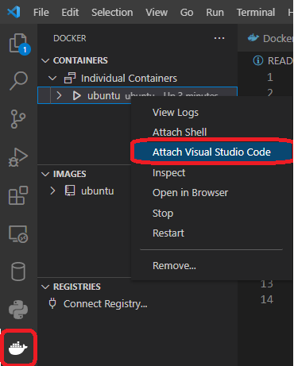

# Docker Ubuntu Shell

## How to use
1. Install [Docker](https://www.docker.com/get-started/)
2. `docker build -t="ubuntu" ./`
3. For first start, `docker run --name ubuntu -it ubuntu`
4. After first start, if you want temporary use, `docker start ubuntu -i`

- if you want to run docker container as background, then

    ```bash
    $ docker start ubuntu
    $ docker attach ubuntu
    ``` 

## Using with VSCode
1. Install VSCode *[Remote - Container](https://marketplace.visualstudio.com/items?itemName=ms-vscode-remote.remote-containers)* extension
2. After download extension, there is a docker icon on left sidebar.
3. Following image make vscode open the ubuntu container

    

## Reference
- [Dockerfile Ubuntu](https://github.com/dockerfile/ubuntu)